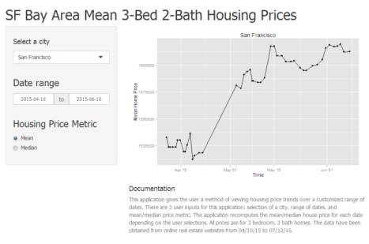

## Summary

* The San Francisco Bay Area is well known to have outrageous home prices.
* The SF Home Price Analyzer app can be used to track the trends in this crazy market!


---

## Why should I use this product?
Often popular news stories will tell you something like "home prices have increased 10% over the last year." While such information might be useful, it does not give any information regarding current and past trends.

This app will plot the market trends for each city in the SF Bay Area.  The user has the option to select the date range of interest as well.

---
  
## Details

* House price data is acquired from real estate websites
* Only 3-bed 2-bath single family homes are included
* The prices are list price only; not sale price

---
  
## In a future release:
* The user may be able to see histograms of the house prices
* The user may be able to see a range of prices at different time points
* No promises though!


```r
houseDist<-(rnorm(1000,mean=mn,sd=hsd)^alpha)/(mn^alpha)*mn
q<-qplot(x=houseDist,geom="histogram",binwidth=100000) + scale_x_continuous() + 
  xlab("Home Price") +  ylab("Number of Homes")
print(q)
```

 

